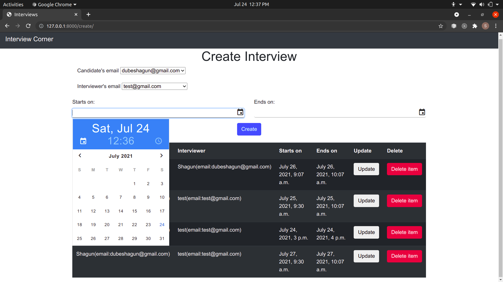
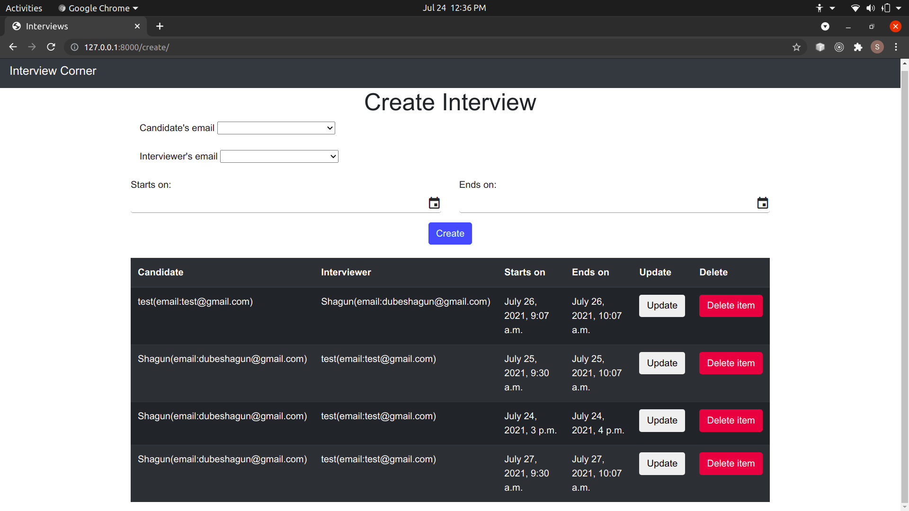
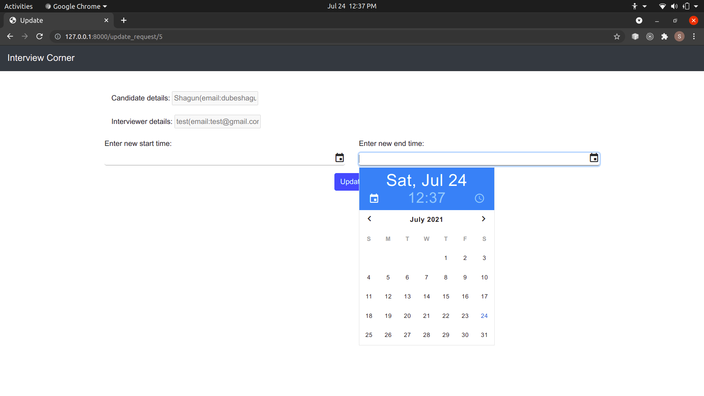

Interview creation portal which contains a page to display the form which takes in the input, perform validity checks, and creates a slot if all requirements are satisfied. If not, an appropriate error message is shown.
Database used: Postgres
Two relations are used - Interview and Participant:

Participant:
  name: Name of the user
  email:Email id of the user, acts as primary key for this table

Interview:
  start_time: Stores the start time for interview slot. 
  end_time: Stores the finishing time for particular interview slot
  cand_mail: References a Participant object , foreign key
  int_mail: References a Participant object , foreign key

Functionality to send mails has been added but is currently disabled. 

